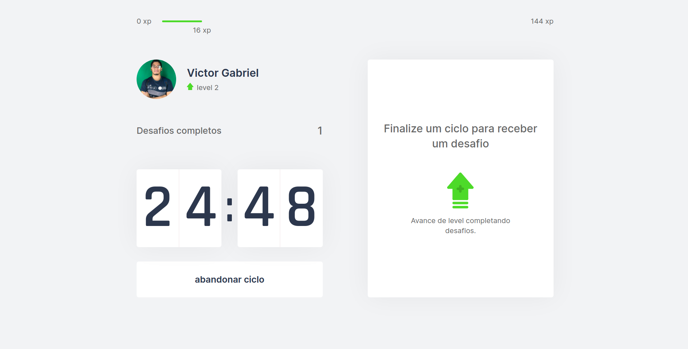
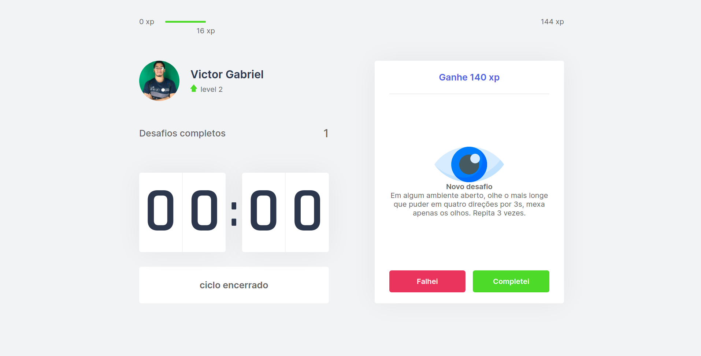
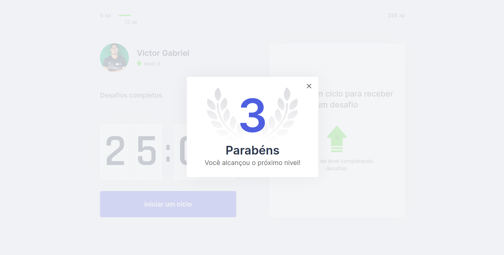

<h3 align="center">
    
</h3>

<p align="center">
   <a href="https://github.com/VictorGabrielMS">
    
  </a>
</p>

<p align="center">
  <a href="https://developer.mozilla.org/pt-BR/docs/Web/JavaScript">
    
  </a>
  <a href="https://www.typescriptlang.org/">
    
  </a>
  <a href="https://nextjs.org/">
    
  </a>
  <a href="https://pt-br.reactjs.org/">
    
  </a>
</p>

## Move.it

- [About](#about)
- [The Application](#application)
- [Techs](#techs)
- [Clone and use for Free](#clone)

<a id="about"></a>

## :interrobang: About

A simple application to make you move your self.

<a id="application"></a>

## :sparkles: The Application

<h1 align="center">
    
    
    
    
</h1>

<a id="techs"></a>

## :diamonds: Techs

The project was developed with the technologies below:

- [Javacript](https://developer.mozilla.org/pt-BR/docs/Web/JavaScript)
- [Typescript](https://www.typescriptlang.org/)
- [Next.js](https://nextjs.org/)
- [Css Modules](https://github.com/css-modules/css-modules)

<a id="clone"></a>

## :octocat:Clone this repo

1. Clone :

```sh
  $ git clone https://github.com/VictorGabrielMS/moveit.git
```

2. Execute:

```sh
  $ cd moveit
```

3. Execute:

```sh
  $ npm install
  $ npm run dev
```

## :memo: License

This project is under MIT LICENSE. for more details follow the link: [LICENSE](LICENSE).
